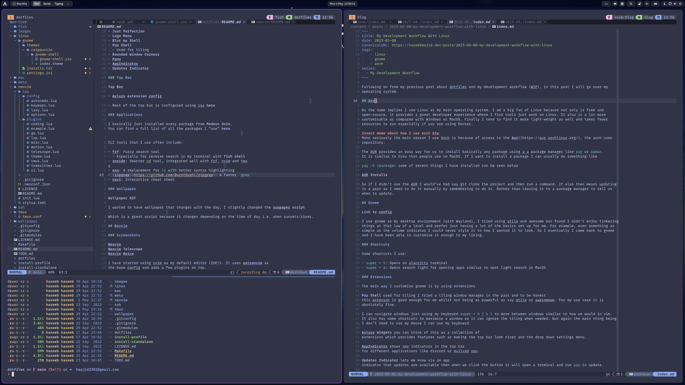
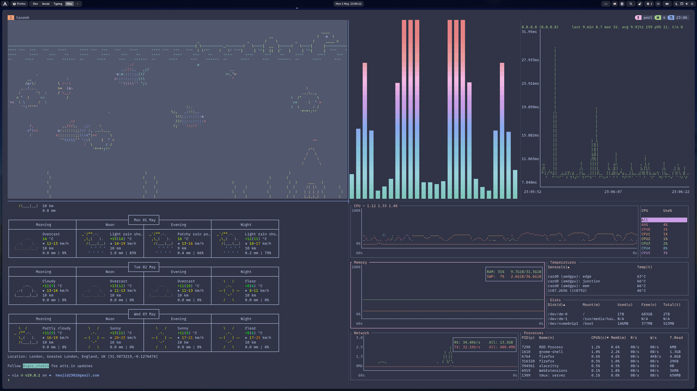
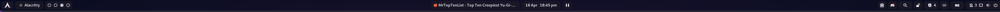
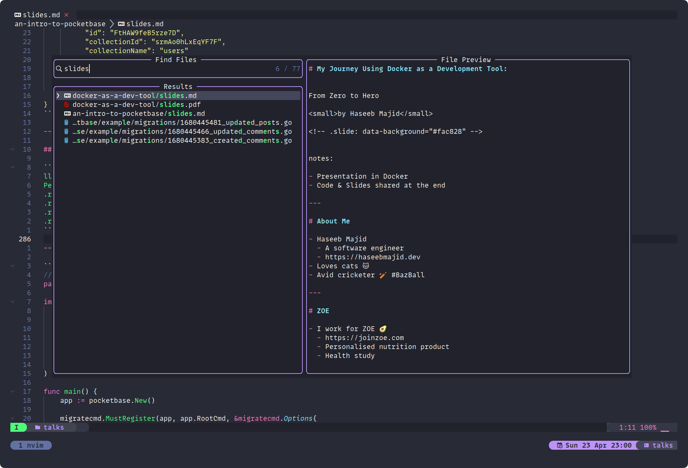
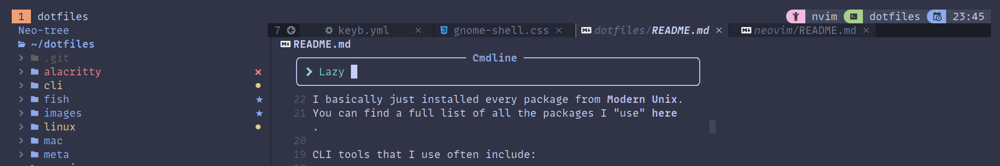

# Dotfiles

<figure class="video_container">
  <iframe src="https://www.youtube.com/embed/enMumwvLAug" frameborder="0" allowfullscreen="true"> </iframe>
</figure>

:house: My dotfiles setup using [Dotbot](https://github.com/anishathalye/dotbot/).

## Install

> :fire: I wouldn't recommend just blinding using my dotfiles. They are setup for my specific use-case. I think you're better picking and choosing what you like :smile:.

```
git clone git@github.com:hmajid2301/dotfiles.git
cd dotfiles
make install profile=arch
```

## System Overview




- OS: Arch Linux
- DE: Gnome
- Shell: Fish
  - Prompt: [Starship](https://starship.rs/)
- Terminal: Alacritty
  - Editor: Neovim (using [LazyVim](https://www.lazyvim.org) config)
- Colorscheme: [Catppuccin for EVERYTHING!!!](https://github.com/catppuccin)
- Fonts: [Mono Lisa](https://www.monolisa.dev/)

### Extensions

I use the following Gnome extension. You can find the config for the extensions in this [massive file here](gnome/settings.ini).

- [Pop Shell](https://github.com/pop-os/shell)
- [Space Bar](https://extensions.gnome.org/extension/5090/space-bar/)
- [Aylurs Widgets](https://extensions.gnome.org/extension/5338/aylurs-widgets/)
- [AppIndicator](https://extensions.gnome.org/extension/615/appindicator-support/)
- [Updates Indicator](https://extensions.gnome.org/extension/1010/archlinux-updates-indicator/)
- [Blur my Shell](https://extensions.gnome.org/extension/3193/blur-my-shell/)
- [Rounded Window Corners](https://extensions.gnome.org/extension/5237/rounded-window-corners/)
- [Pano](https://extensions.gnome.org/extension/5279/pano/)
- [Just Perfection](https://extensions.gnome.org/extension/3843/just-perfection/)
- [Logo Menu](https://extensions.gnome.org/extension/4451/logo-menu/)

### Top Bar



- [Aylurs extension config](https://gitlab.com/hmajid2301/dotfiles/-/blob/93133f7e829409a4a4c943ef38f22ffe2f5c3508/gnome/settings.ini#L763-942)
- Rest of the top bar is configured using css [here](themes/my_theme/gnome-shell/gnome-shell.css)

### Applications

I basically just installed every package from [Modern Unix](https://github.com/ibraheemdev/modern-unix).
You can find a full list of all the packages I "use" [here](https://gitlab.com/hmajid2301/dotfiles/-/blob/main/meta/configs/packages.arch.yaml#L2-48).

CLI tools that I use often include:

- [fzf](https://github.com/junegunn/fzf): Fuzzy search tool
  - Especially for reverse search in my terminal with [fish shell](https://github.com/PatrickF1/fzf.fish)
- [zoxide](https://github.com/ajeetdsouza/zoxide): Smarter cd tool, integrated well with fzf, nvim and tmux
- [exa](https://github.com/ogham/exa): A replacement for `ls` with better syntax highlighting
- [ripgrep](https://github.com/BurntSushi/ripgrep): A faster `grep`
- [navi](https://github.com/denisidoro/navi): Interactive cheat sheet

### Wallpaper


I wanted to have wallpaper that changes with the day, I slightly changed the [sunpaper script](https://github.com/hexive/sunpaper).
Which is a great script because it changes depending on the time of day i.e. when sunsets/rises.

## Neovim

### Screenshots





I have started using nvim as my default editor (IDE?). It uses [LazyVim](lazyvim.org/) as
the base config and adds a few plugins on top.

- [trouble](https://github.com/folke/trouble.nvim): For showing all lsp diagnostic issues in a file
- [telescope zoxide](https://github.com/jvgrootveld/telescope-zoxide): For showing all lsp diagnostic issues in a file

Some of the nvim setup was heavily inspired by this [repo](https://github.com/colevoss/neovoss).
Including the status bar.

Check out this cool place for tracking my neovim setup:

- <https://dotfyle.com/hmajid2301/starter>

## Appendix

- [Dropbox with extra assets](https://www.dropbox.com/sh/rqs2zce3ugf1dz2/AABam3J8BF5WOCvmYjVSXWKIa?dl=0)
- <a href="https://www.flaticon.com/free-icons/dot" title="dot icons">Dot icons created by Roundicons - Flaticon</a>
- [Wallpaper](https://old.reddit.com/r/wallpapers/comments/3ueq55/lakeside_day_night_transition_credit_louis_coyle/)

### Inspired By

- <https://github.com/lime-desu/dootsfile>
- <https://github.com/ghostx31/dotfiles/tree/37587b043f277ff5831ce5f1a3287fbaec1d9fe3>
- <https://github.com/Anant-mishra1729/Village-Linux-rice>
- <https://github.com/colevoss/dotfiles>
