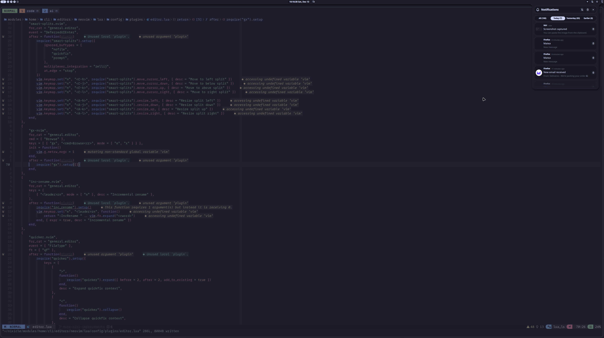

<div align="center">
<h1>
</img> <br>
  Nixicle
</h1>
</h2>
</img>
<p>
  Screenshot updated: 2024-07-15
</p>
<h4>
  :warning: This config repo is constantly changing,
  Let me know if you see something that can be improved or done better :smile: .</h4>
</div>

## 💽 Usage

<details>
  <summary>Install</summary>

To install NixOS on any of my devices I now use [nixos-anywhere](https://github.com/nix-community/nixos-anywhere/blob/main/docs/howtos/no-os.md).
You will need to be able to SSH to the target machine from where this command will be run. Load nix installer ISO if
no OS on the device. You need to copy ssh keys onto the target machine
`mkdir -p ~/.ssh && curl https://github.com/hmajid2301.keys > ~/.ssh/authorized_keys` in my case I can copy them from GitHub.

```bash
git clone git@github.com:hmajid2301/nixicle.git ~/nixicle/
cd nixcile

nix develop

nixos-anywhere --flake '.#workstation' nixos@192.168.1.8 # Replace with your IP
```

After building it you can copy the ISO from the `result` folder to your USB.
Then run `nix_installer`, which will then ask you which host you would like to install.

</details>

### Building

To build my config for a specific host you can do something like:

```bash
git clone git@github.com:hmajid2301/nixicle.git ~/nixicle/
cd nixicle

nix develop

# To build system configuration (uses hostname to build flake)
nh os switch

# To build user configuration (uses hostname and username to build flake)
nh home switch

# Build ISO in result/ folder
nix build .#iso-graphical

# Deploy my to remote server i.e. Home Lab (using SSH)
deploy .#ms01 --hostname ms01 --ssh-user nixos --skip-checks

# Build Home Lab diagram using nix-topology
nix build .#topology.config.output

# Build docker image used in ci
nix build .#containers-ci

# Run neovim
nix run .#homeConfigurations."haseeb@workstation".config.nixCats.out.packages.nixCats

# Build docker image used in ci
nix build .#containers-ci
```

## 🚀 Features

Some features of my config:

- Structured to allow multiple **NixOS configurations**, including **desktop**, **laptop** and **homelab**
- **Custom** live ISO for installing NixOS
- **Styling** with stylix
- **Opt-in persistance** through impermanence + blank snapshot
- **Encrypted BTRFS partition**
- **Secure Boot** with lanzaboote
- **sops-nix** for secrets management
- Different environments like **niri**, **hyprland** and **gnome**
- Custom **Neovim** setup declaratively using **NixCats**
- Homelab all configured in nix.

## 🖼️ Showcase

### Desktop





### Neovim


## Appendix

- <a href="https://www.flaticon.com/free-icons/dot" title="dot icons">Dot icons created by Roundicons - Flaticon</a>
-  You can read more about my dotfiles and development workflows on my [blog here](https://haseebmajid.dev/series/my-development-workflow/) (#ShamelessPlug).
- [Wallpaper From Catppuccin Discord](https://discord.com/channels/907385605422448742/1199293891392852009)
  - Galaxy: https://discord.com/channels/907385605422448742/1199293891392852009
  - Old Catppuccin wallpaper: https://github.com/Gingeh/wallpapers
  - Catppuccino: https://discord.com/channels/907385605422448742/1130546126374838342
  - Catppuccino: https://discord.com/channels/907385605422448742/1130546126374838342

### Inspired By

- Snowfall config: https://github.com/jakehamilton/config?tab=readme-ov-file
- More snowfall config: https://github.dev/khaneliman/khanelinix/blob/f4f4149dd8a0fda1c01fa7b14894b2bcf5653572/flake.nix
- My original structure and nixlang code: https://github.com/Misterio77/nix-config
- Waybar & scripts: https://github.dev/yurihikari/garuda-sway-config
- Neovim UI: https://github.com/NvChad/nvchad
- README: https://github.com/notohh/snowflake/tree/master
- README table: https://github.com/wimpysworld/nix-config
