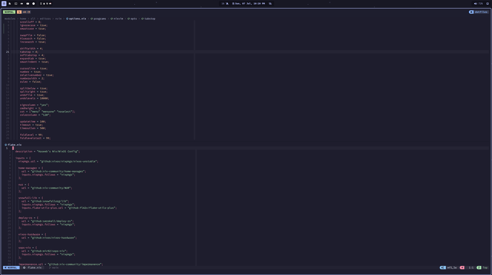
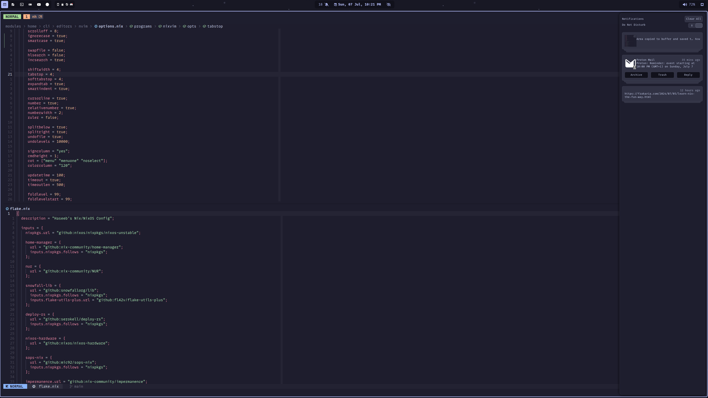
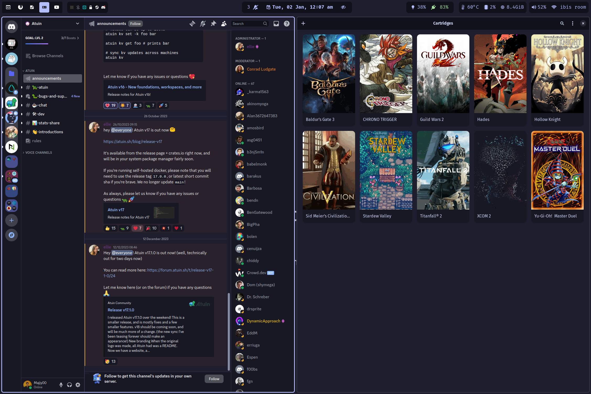
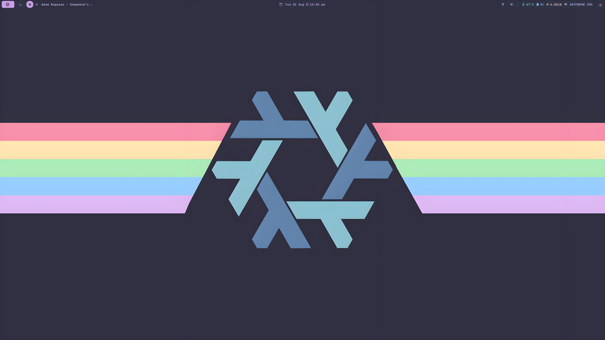
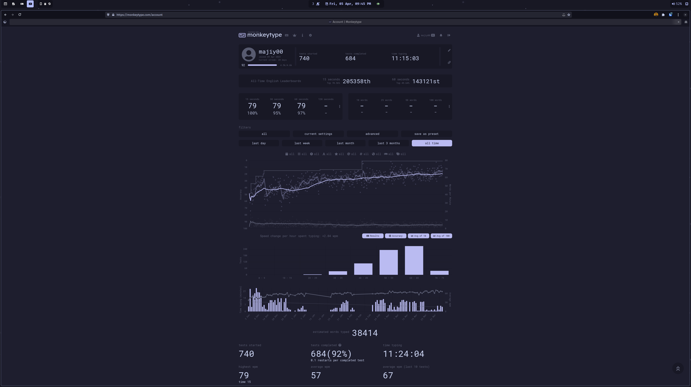
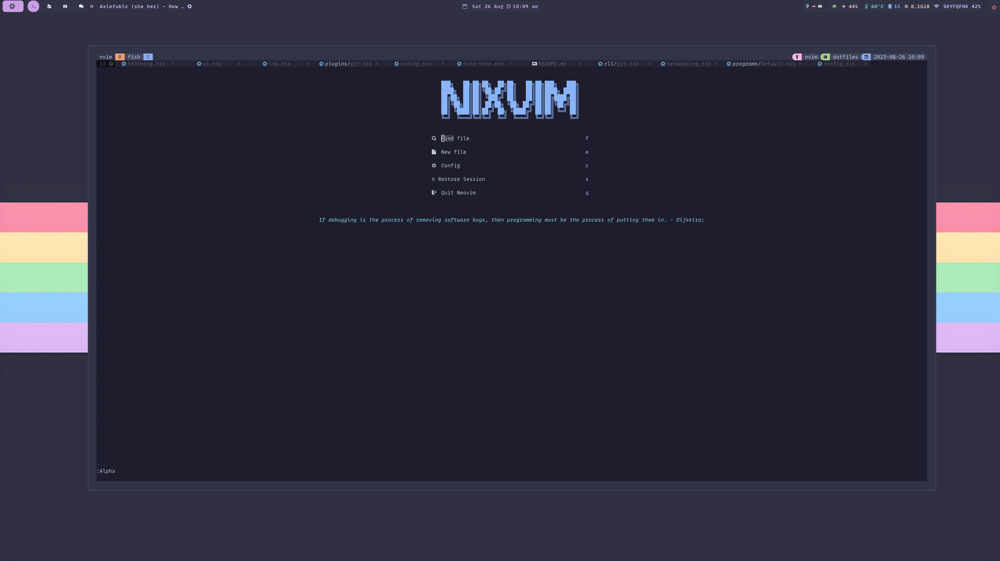
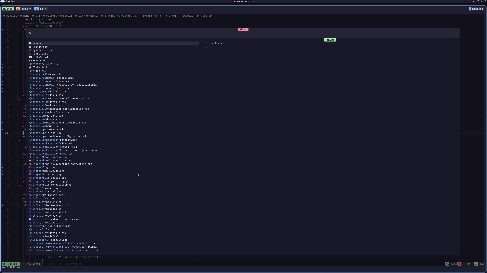
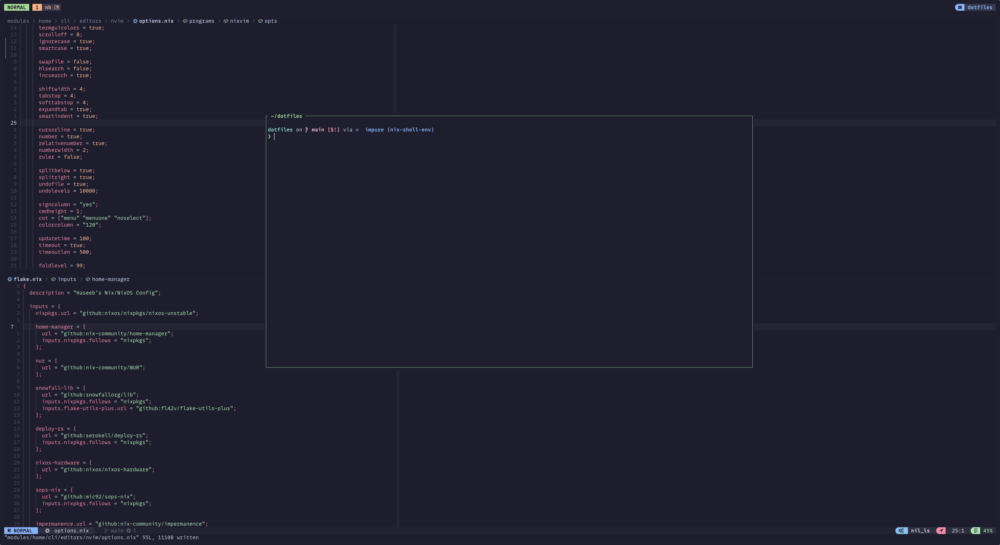
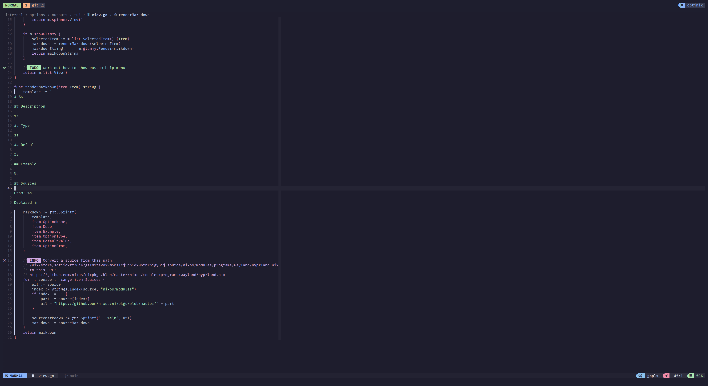
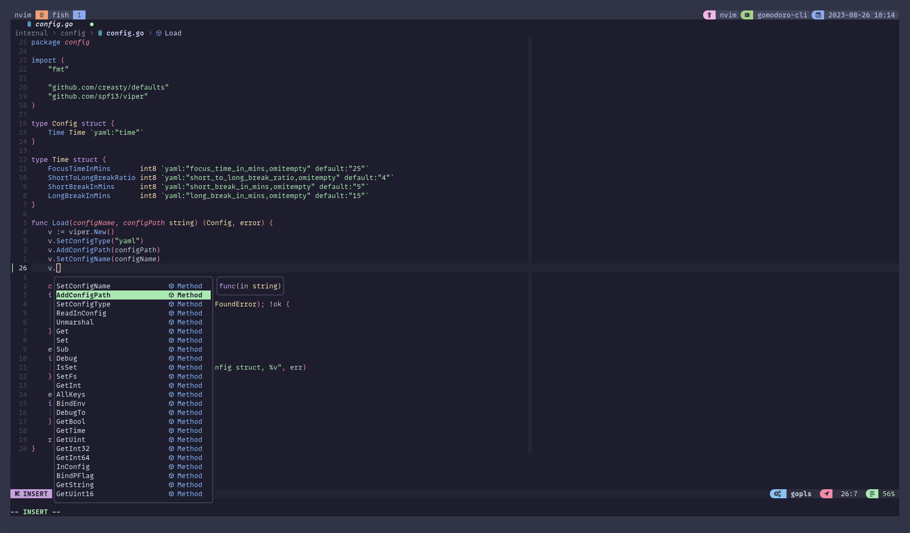

<div align="center">
<h1>
</img> <br>
  Nix Config
</h1>
</h2>
<p></p>
   <a href="https://github.com/hmajid2301/dotfiles/stargazers">
      
   </a>
   <a href="https://github.com/hmajid2301/dotfiles/blob/main">
      
   </a>
    <a href="https://nixos.wiki/wiki/Flakes" target="_blank">
        
    </a>
    <a href="https://github.com/snowfallorg/lib" target="_blank">
        
    </a>
 <p></p>
</img>
<p>
  Screenshot updated: 2024-04-05
</p>
<h4>
  :warning: This config repo is constantly changing,
  Let me know if you see something that can be improved or done better :smile: .</h4>
</div>

## 💽 Usage

<details>
  <summary>Install</summary>

To install NixOS on any of my devices I now use [nixos-anywhere](https://github.com/nix-community/nixos-anywhere/blob/main/docs/howtos/no-os.md).
You will need to be able to SSH to the target machine from where this command will be run. Load nix installer ISO if
no OS on the device. You need to copy ssh keys onto the target machine
`curl https://github.com/hmajid2301.keys > ~/.ssh/authorized_keys` in my case I can copy them from GitHub.

```bash
git clone git@github.com:hmajid2301/dotfiles.git ~/dotfiles/
cd dotfiles

nix develop

nix run github:nix-community/nixos-anywhere -- --flake '.#workstation' nixos@192.168.1.8 # Replace with your IP
```

After building it you can copy the ISO from the `result` folder to your USB.
Then run `nix_installer`, which will then ask you which host you would like to install.

</details>

### Building

To build my dotfiles for a specific host you can do something like:

```bash
git clone git@github.com:hmajid2301/dotfiles.git ~/dotfiles/
cd dotfiles

nix develop

# To build system configuration
sudo nixos-rebuild switch --flake .#framework

# To build user configuration
home-manager switch --flake .#haseeb@framework
```

## 🚀 Features

Some features of my dotfiles:

- Structured to allow multiple **NixOS configurations**, including **desktop**, **laptop**
- **Declarative** config including **themes**, **wallpapers** and **nix-colors**
- **Opt-in persistance** through impermanence + blank snapshot
- **Encrypted btrfs partition**
- **sops-nix** for secrets management
- Different environments like **hyprland**
- Custom live media **ISO**, with an **"automated" install** script
- Custom **neovim** setup declaratively using **nixvim**
- Supports **vfio** for playing games on windows

## 🏠 Configurations


|   Hostname   |            Board                      |               CPU               |  RAM  |         Primary GPU                   |  Role | OS  | State |
| :---------:  | :-------------------------:           | :----------------------------:  | :---: | :-------------------------:           |  :--: | :-: | :---: |
| `workstation`| [X671E AORUS PRO X]                   | [AMD Ryzen 9 7950X]             | 64GB  | [AMD Spectral White 7900 XTX]         | 🖥️     | ❄️   | ✅    |
| `framework`  | [Framework 13th Gen AMD]              | [AMD Ryzen™ 7 7840U]            | 32GB  | [AMD Radeon™ 780M]                    | 💻️    | ❄️   | ✅    |
| `curve`      | [Framework 13th Gen Intel]            | [AMD Ryzen™ 7 7840U]            | 32GB  | [Intel Iris Pro Graphics]             | 💻️    | 🐧  | ✅    |
| `VM`         | [QEMU]                                | -                               | -     | [VirGL]                               |  🐄   | ❄️   | ✅    |

**Key**

- 🖥️ : Desktop
- 💻️ : Laptop
- 🎮️ : Games Machine
- 🐄 : Virtual Machine
- ☁️ : Server

## 📱 Applications

| Type           | Program      |
| :------------- | :----------: |
| OS             | [NixOS](https://nixos.com/) |
| Editor         | [NeoVim](https://neovim.io/) |
| Multiplexer    | [Zellij](https://github.com/zellij-org/zellij) |
| Prompt         | [Starship](https://starship.rs/) |
| Launcher       | [Rofi](https://github.com/davatorium/rofi) |
| Shell          | [Fish](https://fishshell.com/) |
| Status Bar     | [Waybar](https://github.com/Alexays/Waybar) |
| Terminal       | [Wezterm](https://github.com/wez/wezterm) |
| Window Manager | [Hyprland](https://hyprland.org/) |
| Fonts          | [Mono Lisa](https://www.monolisa.dev/) |
| Colorscheme    | [Catppuccin Mocha](https://github.com/catppuccin) |

### Neovim

My [ neovim config ](./modules/home/cli/editors/nvim/) is made using [nixvim](https://github.com/pta2002/nixvim/).
Which converts all the nix files into a single "large" init.lua file.

As you will see down below a lot of the UI elements were inspired/copied from nvchad. As I think they have really nice
looking editor altogether. Particularly the cmp menu, telescope and also the status line.

#### Plugins

Some of the main plugins used in my nvim setup include:

- Session: auto-session
- Status Line: lualine
- Buffer Line: bufferline
- Winbar: barbecue & navic
- File Explorer: mini.files and oil.nvim
- LSP: lsp, nvim-cmp, luasnip, friendly-snippets
- Git: gitsigns, lazygit
- ColourScheme: notkens12 base46 (nvchad catppuccin)
- Other: telescope (ofc)

## 🖼️ Showcase

### Desktop







### Neovim







## Appendix

- <a href="https://www.flaticon.com/free-icons/dot" title="dot icons">Dot icons created by Roundicons - Flaticon</a>
-  You can read more about my dotfiles and development workflows on my [blog here](https://haseebmajid.dev/series/my-development-workflow/) (#ShamelessPlug).
- [Wallpaper From Catppuccin Discord](https://discord.com/channels/907385605422448742/1199293891392852009)
  - Galaxy: https://discord.com/channels/907385605422448742/1199293891392852009
  - Old Catppuccin wallpaper: https://github.com/Gingeh/wallpapers
  - Catppuccino: https://discord.com/channels/907385605422448742/1130546126374838342
  - Catppuccino: https://discord.com/channels/907385605422448742/1130546126374838342

### Inspired By

- Snowfall config: https://github.com/jakehamilton/config?tab=readme-ov-file
- More snowfall config: https://github.dev/khaneliman/khanelinix/blob/f4f4149dd8a0fda1c01fa7b14894b2bcf5653572/flake.nix
- My original structure and nixlang code: https://github.com/Misterio77/nix-config
- Waybar & scripts: https://github.dev/yurihikari/garuda-sway-config
- Neovim UI: https://github.com/NvChad/nvchad
- README: https://github.com/notohh/snowflake/tree/master
