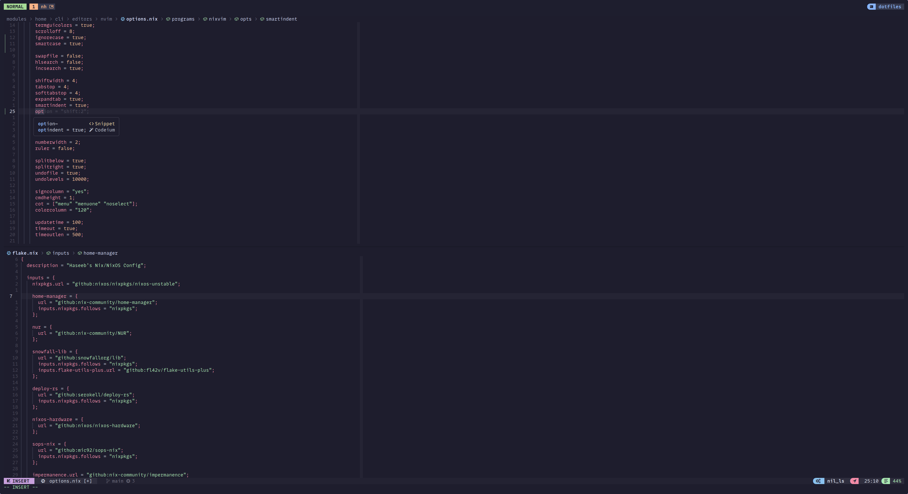

██████╗░░█████╗░████████╗███████╗██╗██╗░░░░░███████╗░██████╗
██╔══██╗██╔══██╗╚══██╔══╝██╔════╝██║██║░░░░░██╔════╝██╔════╝
██║░░██║██║░░██║░░░██║░░░█████╗░░██║██║░░░░░█████╗░░╚█████╗░
██║░░██║██║░░██║░░░██║░░░██╔══╝░░██║██║░░░░░██╔══╝░░░╚═══██╗
██████╔╝╚█████╔╝░░░██║░░░██║░░░░░██║███████╗███████╗██████╔╝
╚═════╝░░╚════╝░░░░╚═╝░░░╚═╝░░░░░╚═╝╚══════╝╚══════╝╚═════╝░


<div align="center">
  <h1> Haseeb's Dot Files :house_with_garden:</h1>
  <a href="https://git.io/typing-svg"></a>
</div>

##  Install

> :fire: I wouldn't recommend just blinding using my dotfiles. They are setup for my specific use-case.
I think you're off using this repo as reference to create your own dotfiles.

```bash
git clone git@github.com:hmajid2301/dotfiles.git ~/dotfiles/
cd dotfiles

nix develop

# To build system configuration
sudo nixos-rebuild --flake .#framework

# To build user configuration
home-manager --flake .#framework
```

You can read more about my dotfiles and development workflows on my [blog here](https://haseebmajid.dev/series/my-development-workflow/) (#ShamelessPlug).

> Note my dotfiles are almost always changing!

## 🚀 Features

Some features of my dotfiles:

- Structured to allow multiple **NixOS configurations**, including **desktop**, **laptop**
- **Declarative** config including **themes**, **wallpapers** and **nix-colors**
- **Opt-in persistance** through impermanence + blank snapshot
 - Delete files on boot
- **Encrypted btrfs partition** 
- **sops-nix** for secrets management
- Different environments like **hyprland** and **gnome**
- Laptop setup with eGPU and **vfio** for playing games on windows
- Custom **neovim** setup using **nixvim**


## 🏠 Structure

- `flake.nix`: Entrypoint for hosts and home configurations
- `nixos`: 
  - `global`: Configurations that are globally applied to all my machines
  - `optional`: Configurations that some of my machines use
- `hosts`: NixOS Configurations, accessible via `nixos-rebuild --flake`.
  - `framework`: Framework 12th gen laptop | Hyprland | eGPU 3080
  - `curve`: Framework 13th gen work laptop | Ubuntu Hyprland
  - `mesmer`: Desktop AMD Ryzen 9 5950X  | Hyprland | GPU 7900 XTX
- `home-manager`: Most of my dotfiles configuration, user specific

## 󱃷 Applications

| Type           | Program      |
| :------------- | :----------: |
| OS             | [NixOS](https://nixos.com/) |
| Editor         | [NeoVim](https://neovim.io/) |
| Prompt         | [Starship](https://starship.rs/) |
| Launcher       | [Rofi](https://github.com/davatorium/rofi) |
| Shell          | [Fish](https://fishshell.com/) |
| Status Bar     | [Waybar](https://github.com/Alexays/Waybar) |
| Terminal       | [Alacritty](https://github.com/alacritty/alacritty) |
| Window Manager | [Hyprland](https://hyprland.org/) |
| Fonts          | [Mono Lisa](https://www.monolisa.dev/) |
| Colorscheme    | [Catppuccin](https://github.com/catppuccin) |

I basically just installed every package from [Modern Unix](https://github.com/ibraheemdev/modern-unix).
CLI tools that I use often include:

- [fzf](https://github.com/junegunn/fzf): Fuzzy search tool
  - Especially for reverse search in my terminal with [fish shell](https://github.com/PatrickF1/fzf.fish)
- [zoxide](https://github.com/ajeetdsouza/zoxide): Smarter cd tool, integrated well with fzf, nvim and tmux
- [exa](https://github.com/ogham/exa): A replacement for `ls` with better syntax highlighting
- [ripgrep](https://github.com/BurntSushi/ripgrep): A faster `grep`

###  Tmux

Some of the plugins I leverage with [tmux](./home-manager/multiplexers/tmux.nix) include:

I manage my projects using tmux sessions with the [tmux smart session manager](https://github.com/joshmedeski/t-smart-tmux-session-manager).

Where I create a new session for each project I'm working on and then jump between them.
Where a project might be:

- My Blog
- My Dotfiles
- Full stack application
  - A window for each project i.e. GUI and API

I also leverage [tmux-browser](https://github.com/ofirgall/tmux-browser), to keep different browser windows for different projects.

Another set of plugins I use are the [tmux-resurrect/continuum](https://github.com/tmux-plugins/tmux-continuum)
plugins to auto save and restore my sessions. Alongside neovim's auto-session we can restore almost everything.

###  neovim

My [ neovim config ](./home-manager/editors/nvim/) is made using [nixvim](https://github.com/pta2002/nixvim/).
Which converts all the nix files into a single "large" init.lua file. It also provides an easy way to add
[ extra plugins and extra lua config  ](./home-manager/editors/nvim/plugins/coding.nix) that nixvim itself doesn't provide.

As you will see down below a lot of the UI elements were inspired/copied from nvchad. As I think they have really nice
looking editor altogether. Particularly the cmp menu, telescope and also the status line.

#### Plugins

Some of the main plugins used in my nvim setup include:

- Dashboard: alpha
- Session: auto-session
- Status Line: lualine
- Buffer Line: bufferline
- Winbar: barbecue & navic
- File Explorer: nvim-tree
- LSP: lsp, nvim-cmp, luasnip, friendly-snippets
- Git: gitsigns, toggleterm (with lazygit)
- ColourScheme: notkens12 base46 (nvchad catppuccin)
- Other: telescope (ofc)

##  Showcase

### Desktop


### Neovim




## Appendix

- <a href="https://www.flaticon.com/free-icons/dot" title="dot icons">Dot icons created by Roundicons - Flaticon</a>

### Inspired By

- Structure and nixlang code: https://github.com/Misterio77/nix-config
- Waybar & scripts: https://github.dev/yurihikari/garuda-sway-config
- Neovim UI: https://github.com/NvChad/nvchad
