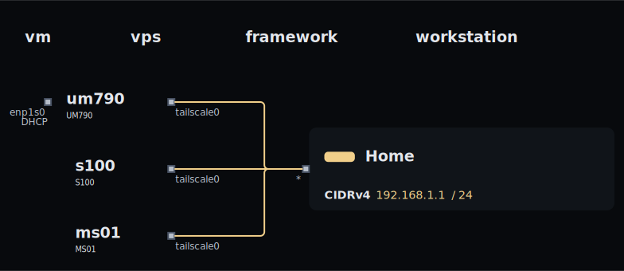
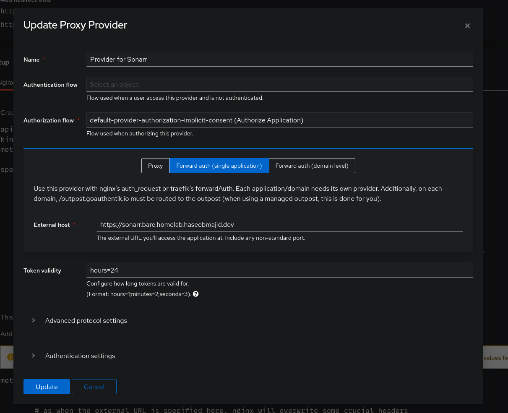
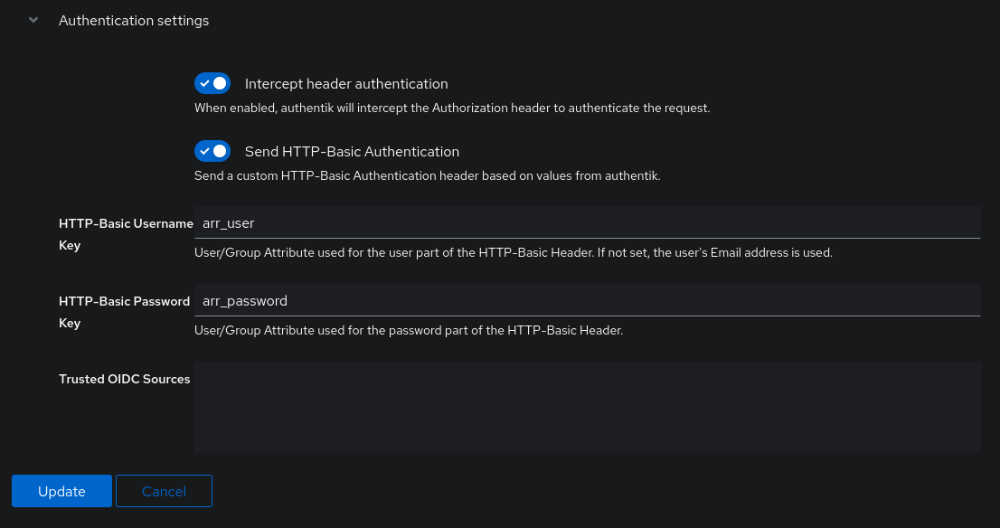
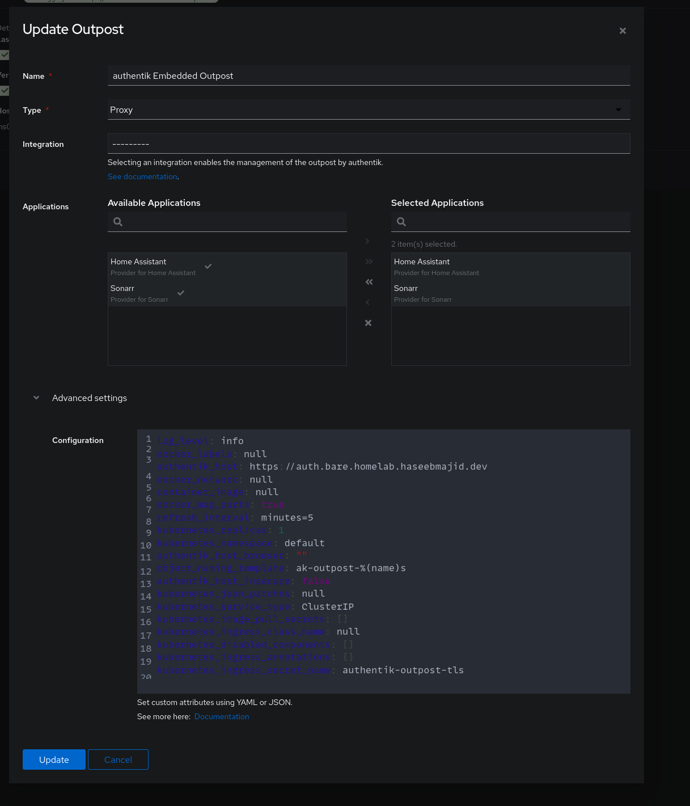
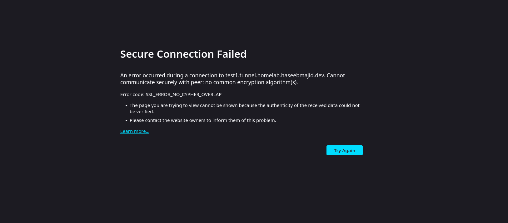
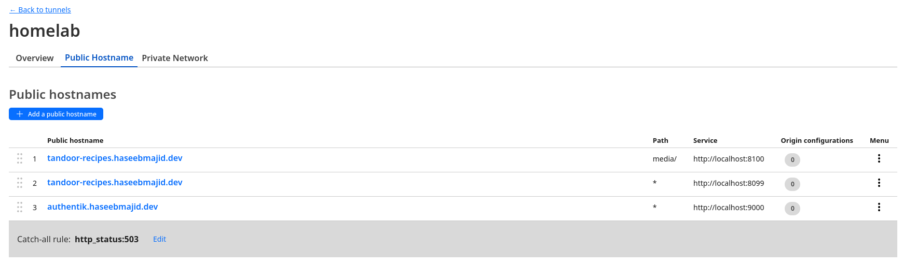

# home lab docs

## 🖳  Diagram

This nix config also contains some of the config for my homelab, mostly the bare metal management of the machine.
All the kubernetes config can be found [here](https://gitlab.com/hmajid2301/homelab).

<details>
<summary>🕸️ HomeLab Diagram</summary>




</details>

## tandoor

no social logisn firs time setup then enable

          SOCIAL_DEFAULT_GROUP = "user";
          SOCIAL_PROVIDERS = "allauth.socialaccount.providers.openid_connect";

## Tandoor auth


set  SOCIALACCOUNT_PROVIDERS

```json
{ "openid_connect": { "SERVERS": [ { "id": "tandoor", "name": "authentik", "server_url": "https://auth.homelab.haseebmajid.dev/application/o/tandoor/.well-known/openid-configuration", "token_auth_method": "client_secret_basic", "APP": { "client_id": "", "secret": "", }, } ] }}
```

Ref: https://github.com/TandoorRecipes/recipes/issues/970
allow us to include the env data in systemd

    systemd.services.paperless-web = {
      serviceConfig = {
        EnvironmentFile = [config.sops.secrets.paperless.path];
      };
      after = ["postgresql.service"];
    };

don't set redirect allow it to be set first time request is made.

### Tandoor Photos

```
Hi, I’ve been bitten by the same issue. I was able to pinpoint the issue by looking into nginx logs:

journalctl -u nginx.service

I was able to find the following line:

Apr 23 13:23:48 odroid nginx[577544]: 2024/04/23 13:23:48 [error] 577544#577544: *3442 open() "/var/lib/tandoor-recipes/recipes/91463ea6-4fad-4b90-b9e1-67230ebd20d7_18.jpg" failed (13: Permission denied), client: 192.168.0.128, server: tandoor.house.flakm.com, request: "GET /media/recipes/91463ea6-4fad-4b90-b9e1-67230ebd20d7_18.jpg HTTP/2.0", host: "tandoor.house.flakm.com", referrer: "https://tandoor.house.flakm.com/search/"

The line might be different for you, but it shows that Nginx does not have permission to file files in the expected location. You can check this by issuing:

sudo su - nginx -s $(which bash)
# and now you can test:
[nginx@odroid:~]$ cd /var/lib/tandoor-recipes/                                
-bash: cd: /var/lib/tandoor-recipes/: Permission denied 
[nginx@odroid:~]$ cd /var/lib/private/                                
-bash: cd: /var/lib/private/: Permission denied 

Systemd configuration for the service 1 uses DynamicUser as you can see here: systemd.exec 1

So, to fix this, I had to add nginx into relevant groups:

  users.groups.tandoor-recipes.members = [ "nginx" ];

Add nginx alias for media in locations:

          "/media/".alias = "/var/lib/tandoor-recipes/";

And issue the following commands:

# allow users to enter into this directory
sudo chmod o+x /var/lib/private/tandoor-recipes
sudo chmod o+x /var/lib/private/

You can read all the configuration here: tandoor.nix 6

I’m adding +x so the nginx user can enter the directory owned by the root:root.

Having execute permission on a directory authorizes you to look at extended information on files in the directory (using ls -l, for instance) but also allows you to change your working directory (using cd) or pass through this directory on your way to a subdirectory underneath.

And nginx to group tandoor-receipes so it can read the files owned by the tandoor’s dynamic user.
```

https://github.com/FlakM/nix_dots/blob/main/hosts/odroid/tandoor.nix

      services.nginx = {
        enable = true;
        virtualHosts = {
          "recipes-media" = {
            listen = [
              {
                addr = "localhost";
                port = 8100;
              }
            ];
            locations = {
              "/media/" = {
                alias = "/var/lib/tandoor-recipes/";
              };
            };
          };
        };
      };


      traefik = {
        dynamicConfigOptions = {
          http = {
            services = {
              recipes-media.loadBalancer.servers = [
                {
                  url = "http://localhost:8100";
                }
              ];
              recipes.loadBalancer.servers = [
                {
                  url = "http://localhost:8099";
                }
              ];
            };

            routers = {
              recipes = {
                entryPoints = ["websecure"];
                rule = "Host(`recipes.homelab.haseebmajid.dev`)";
                service = "recipes";
                tls.certResolver = "letsencrypt";
              };

              recipes-media = {
                entryPoints = ["websecure"];
                rule = "Host(`recipes.homelab.haseebmajid.dev`) && PathPrefix(`/media`)";
                service = "recipes-media";
                tls.certResolver = "letsencrypt";
              };
            };
          };
        };


## Audible

Get activation from here https://audible-tools.kamsker.at/

```bash
ffmpeg -activation_bytes XXXX -i audiobook.aax audiobook.mp3
```

https://kylepiira.com/2019/05/12/how-to-break-audible-drm/

## Traefik authentik forward auth





The key here being the outpost needs to use https and 9443

```nix

      traefik = {
        dynamicConfigOptions = {
          http = {
            middlewares = {
              authentik = {
                forwardAuth = {
                  tls.insecureSkipVerify = true;
                  address = "https://localhost:9443/outpost.goauthentik.io/auth/traefik";
                  trustForwardHeader = true;
                  authResponseHeaders = [
                    "X-authentik-username"
                    "X-authentik-groups"
                    "X-authentik-email"
                    "X-authentik-name"
                    "X-authentik-uid"
                    "X-authentik-jwt"
                    "X-authentik-meta-jwks"
                    "X-authentik-meta-outpost"
                    "X-authentik-meta-provider"
                    "X-authentik-meta-app"
                    "X-authentik-meta-version"
                  ];
                };
              };
            };

            services = {
              auth.loadBalancer.servers = [
                {
                  url = "http://localhost:9000";
                }
              ];
            };

            routers = {
              auth = {
                entryPoints = ["websecure"];
                rule = "Host(`auth.homelab.haseebmajid.dev`) || HostRegexp(`{subdomain:[a-z0-9]+}.homelab.haseebmajid.com`) && PathPrefix(`/outpost.goauthentik.io/`)";
                service = "auth";
                tls.certResolver = "letsencrypt";
              };
            };
          };
        };
      };
```


set middleware on sonarr

````nix
  sonarr = {
    entryPoints = ["websecure"];
    rule = "Host(`sonarr.homelab.haseebmajid.dev`)";
    service = "sonarr";
    tls.certResolver = "letsencrypt";
    middlewares = ["authentik"];
  };
````

## HA

````nix

{
  lib,
  pkgs,
  fetchFromGitHub,
  buildHomeAssistantComponent,
}:
buildHomeAssistantComponent rec {
  owner = "graham33";
  domain = "octopus-energy";
  version = "12.2.0";
  format = "other";

  src = fetchFromGitHub {
    owner = "BottlecapDave";
    repo = "HomeAssistant-OctopusEnergy";
    rev = "v${version}";
    sha256 = "sha256-qBvr+7oMAhTyxlWSo+CPddZ00aIGt+0s3x/LlEKUrN4=";
  };

  checkInputs = with pkgs.python312Packages;
  with pkgs; [
    home-assistant
    mock
    psutil-home-assistant
    pytest
    pytest-socket
    pytest-asyncio
    sqlalchemy
  ];

  checkPhase = ''
    python -m pytest tests/unit
  '';

  meta = with lib; {
    homepage = "https://github.com/BottlecapDave/HomeAssistant-OctopusEnergy";
    license = licenses.mit;
    description = "Custom component to bring your Octopus Energy details into Home Assistant";
    maintainers = with maintainers; [graham33];
  };
}
````

## NixOS


```bash
sudo -u postgres psql

psql (14.13)
Type "help" for help.

postgres-# \l
                                        List of databases
      Name       |      Owner      | Encoding |   Collate   |    Ctype    |   Access privileges
-----------------+-----------------+----------+-------------+-------------+-----------------------
 authentik       | authentik       | UTF8     | en_GB.UTF-8 | en_GB.UTF-8 |
 postgres        | postgres        | UTF8     | en_GB.UTF-8 | en_GB.UTF-8 |
 tandoor         | tandoor         | UTF8     | en_GB.UTF-8 | en_GB.UTF-8 |
 template0       | postgres        | UTF8     | en_GB.UTF-8 | en_GB.UTF-8 | =c/postgres          +
                 |                 |          |             |             | postgres=CTc/postgres
 template1       | postgres        | UTF8     | en_GB.UTF-8 | en_GB.UTF-8 | =c/postgres          +
                 |                 |          |             |             | postgres=CTc/postgres
postgres=# DROP DATABASE "tandoor";
postgres=# \l
                                  List of databases
   Name    |   Owner   | Encoding |   Collate   |    Ctype    |   Access privileges
-----------+-----------+----------+-------------+-------------+-----------------------
 authentik | authentik | UTF8     | en_GB.UTF-8 | en_GB.UTF-8 |
 postgres  | postgres  | UTF8     | en_GB.UTF-8 | en_GB.UTF-8 |
 template0 | postgres  | UTF8     | en_GB.UTF-8 | en_GB.UTF-8 | =c/postgres          +
           |           |          |             |             | postgres=CTc/postgres
 template1 | postgres  | UTF8     | en_GB.UTF-8 | en_GB.UTF-8 | =c/postgres          +
           |           |          |             |             | postgres=CTc/postgres

postgres=# \c immich
WARNING:  database "immich" has a collation version mismatch
DETAIL:  The database was created using collation version 2.39, but the operating system provides version 2.40.
HINT:  Rebuild all objects in this database that use the default collation and run ALTER DATABASE immich REFRESH COLLATION VERSION, or build PostgreSQL with the right library version.
You are now connected to database "immich" as user "postgres".
immich=# SELECT * FROM users;
immich=# SELECT * FROM users;
immich=# UPDATE users SET "isAdmin"='t' WHERE email='hello@haseebmajid.dev';
UPDATE 1
```

### Cloudflare


The configuration you provided expects a credentials file that is usually generated after you run the cloudflared tunnel create command. However, since you only have a token, you can still configure the tunnel by following these steps:
Steps to Use a Token Instead of a Credentials File:

    Install Cloudflared (if not already installed): Ensure that cloudflared is installed on your system. If not, you can install it using the following command:

    bash nix-env -iA nixpkgs.cloudflared

    Authenticate Using the Token: Use the provided token to authenticate and create the credentials file. Run the following command in your terminal:

    bash cloudflared tunnel login

    This command will prompt you to open a browser and log in to your Cloudflare account. Once logged in, Cloudflare will generate a certificate and place it in ~/.cloudflared/cert.pem.

    Create a New Tunnel Using the Token: Now, use the token to create a new tunnel and automatically generate the required credentials file:

    bash cloudflared tunnel create your-tunnel-name

    This command will generate a credentials file, usually located at ~/.cloudflared/your-tunnel-name.json.

    Update Your NixOS Configuration: Once the credentials file is generated, you can reference it in your NixOS configuration like this:

    ```nix { config, pkgs, ... }:

    { services.cloudflared = { enable = true; tunnels = { “your-tunnel-name” = { default = “http_status:404”; ingress = { “your-domain.com” = “http://localhost:8000”; }; credentialsFile = “/var/lib/cloudflared/your-tunnel-name.json”; }; }; }; } ```

    Make sure to copy the generated credentials file to /var/lib/cloudflared/your-tunnel-name.json or update the path in the configuration to where the file is located.

    Restart Cloudflared Service: Finally, apply the NixOS configuration and restart the cloudflared service:

    bash sudo nixos-rebuild switch sudo systemctl restart cloudflared

This should set up the Cloudflare tunnel correctly using the token and credentials file.

 
On top of all of that, you will want to add a CNAME entry to your domain:

cloudflared tunnel route dns <tunnel name/id> <hostname>

This is how I like my ./tunnels.nix:

{ config, pkgs, ... }:

{
  environment.systemPackages = with pkgs; [
    pkgs.unstable.cloudflared
  ];

  services.cloudflared = {
    enable = true;
    user = "my-user";
    package = pkgs.unstable.cloudflared;
    tunnels = {
      "xxxx-xxxx-xxxx" = {
        credentialsFile = "${config.users.users.my-user.home}/.cloudflared/xxxx-xxxx-xxxx.json";
        default = "http_status:404";
        ingress = {
          "*.example.com" = {
            service = "http://localhost:8080";
          };
        };
      };
    };
  };

}

key being owner is cloudflared

    sops.secrets.cloudflared = {
      sopsFile = ../secrets.yaml;
      owner = "cloudflared";
    };

That error message indicates that hostname is too deep to be covered by Universal SSL. See the following chart for details.
Hostname 	Covered by Universal certificate?
example.com 	Yes
www.example.com 	Yes
docs.example.com 	Yes
dev.docs.example.com 	No
test.dev.api.example.com 	No

hostname needs to be like tandoor-recipes.haseebmajid.dev



Multi domain authentik: https://www.youtube.com/watch?v=tqimi3SdvCQ




#### DNS

```bash
cloudflared tunnel route dns ff77cc7c-6f69-406a-b86c-4ed3afde0093 budibase.haseebmajid.dev
2024-12-15T21:46:51Z INF Added CNAME budibase.haseebmajid.dev.banterbus.games which will route to this tunnel tunnelID=ff77cc
7c-6f69-406a-b86c-4ed3afde0093
```

## Sops

sops multiline enviornment files
```yaml
tandoor: |
    SOCIALACCOUNT_PROVIDERS='{ "openid_connect": { "SERVERS": [ { "id": "tandoor", "name": "authentik", "server_url": "https://authentik.haseebmajid.dev/application/o/tandoor/.well-known/openid-configuration", "token_auth_method": "client_secret_basic", "APP": { "client_id": "", "secret": "", }, } ] }}'
    SECRET_KEY=""
```

- note = not a colon `:`.
- quote `"#"` say passwords surround it with quotes can break yaml syntax.


## Jellyfin lost user access

```bash
nix-shell -p sqlite
systemctl stop jellyfin.service
sudo sqlite3 /var/lib/jellyfin/data/jellyfin.db "select id from users where username='REPLACE';"
sudo sqlite3 /var/lib/jellyfin/data/jellyfin.db "update permissions set value=1 where kind=0 and permission_permissions_guid='REPLACE';"
systemctl start jellyfin.service
```

### homepage assistant

[
              {
                Synology = {
                  icon = "synology.png";
                  href = "{{HOMEPAGE_VAR_SYNOLOGY_URL}}";
                  description = "NAS";
                  widget = {
                    type = "diskstation";
                    url = "{{HOMEPAGE_VAR_SYNOLOGY_INTERNAL_URL}}";
                    username = "{{HOMEPAGE_VAR_SYNOLOGY_USERNAME}}";
                    password = "{{HOMEPAGE_VAR_SYNOLOGY_PASSWORD}}";
                  };
                };
              }
            ]


    HOMEPAGE_VAR_SYNOLOGY_URL=https://nas.homelab.haseebmajid.dev
    HOMEPAGE_VAR_SYNOLOGY_INTERNAL_URL=http://192.168.1.73:5000
    HOMEPAGE_VAR_SYNOLOGY_USERNAME=homepage
    HOMEPAGE_VAR_SYNOLOGY_PASSWORD=

## Gitlab

this error when using with nix

ERROR: Job failed (system failure): Error response from daemon: failed to create task for container: failed to create shim task: OCI runtime create failed: runc create failed: unable to start container process: exec: "sh": executable file not found in $PATH: unknown (exec.go:78:0s)


 fix this permissiosn
ls -al /var/run/docker.sock
srw-rw---- 1 root docker 0 Sep 12 20:53 /var/run/docker.sock

#### dind


    services.gitlab-runner = {
      enable = true;
      settings = {
        concurrent = 10;
      };
      services = {
        default = {
          authenticationTokenConfigFile = config.sops.secrets.gitlab_runner_env.path;
          limit = 10;
          dockerImage = "debian:stable";
          dockerPrivileged = true;
          dockerVolumes = [
            "/cache"
          ];
        };
      };
    };


to publish

publish:dev-docker:
  stage: dev
  variables:
    DOCKER_HOST: tcp://docker:2375
    DOCKER_DRIVER: overlay2
    DOCKER_TLS_CERTDIR: ""
  only:
    - merge_request
  services:
    - docker:25-dind
  script:
    - echo "experimental-features = nix-command flakes" > /etc/nix/nix.conf
    - nix-env -iA nixpkgs.docker
    - docker info
    - nix build .#docker-shell
    - docker load < ./result
    - docker login -u $CI_REGISTRY_USER -p $CI_REGISTRY_PASSWORD $CI_REGISTRY
    # TODO: work out how to do versioning to make this pipeline reproducible
    - docker image tag banterbus-dev:latest $CI_REGISTRY_IMAGE:latest
    - docker push $CI_REGISTRY_IMAGE:latest

## syncthing

Old topic, but for me, it was due to my password manager auto-filling the password for the shared folder with the main Syncthing web password:


## cloudflare traefik authentik

  config,
  lib,
  ...
}: {
      cloudflared = {
        enable = true;
        tunnels = {
          "ec0b6af0-a823-4616-a08b-b871fd2c7f58" = {
            ingress = {
              "navidrome.haseebmajid.dev" = "https://localhost";
            };
          };
        };
      };

      traefik = {
        dynamicConfigOptions = {
          http = {
            services = {
              navidrome.loadBalancer.servers = [
                {
                  url = "http://localhost:4533";
                }
              ];
            };

            routers = {
              navidrome = {
                entryPoints = ["websecure"];
                rule = "Host(`navidrome.haseebmajid.dev`)";
                service = "navidrome";
                tls.certResolver = "letsencrypt";
                middlewares = ["authentik"];
              };
            };
          };
        };
      };
    };
  };
}


## Setup flux

setup k3s

copy config.personal (look at .envrc): https://docs.k3s.io/cluster-access

```bash
flux bootstrap gitlab \
              --owner=hmajid2301 \
              --repository=k3s-config \
              --branch=main \
              --path=clusters \
              --personal \
            --read-write-key=true --token-auth=false --components-extra=image-reflector-controller,image-automation-controller
```

for cert-manager

kubectl apply -f https://github.com/jetstack/cert-manager/releases/download/v1.15.0/cert-manager.crds.yaml


for sops

```
age-keygen -o age.agekey
# Public key: age1helqcqsh9464r8chnwc2fzj8uv7vr5ntnsft0tn45v2xtz0hpfwq98cmsg

cat age.agekey |
kubectl create secret generic sops-age \
--namespace=flux-system \
--from-file=age.agekey=/dev/stdin

```

update .sops.yaml

```
creation_rules:
  - path_regex: .*.yaml
    encrypted_regex: ^(data|stringData)$
    age: age1ham2fhsrkrjhstzwxxzmuqxeql86wm75lul6cu2xe4zwew5zg3vq3mfvm5
```

in gotk-sync.yaml

```
spec:
  interval: 10m0s
  path: ./clusters
  prune: true
  sourceRef:
    kind: GitRepository
    name: flux-system
  decryption:
    provider: sops
    secretRef:
      name: sops-age
```

### Test Branch


in `gotk-sync.yaml`


```yaml
apiVersion: source.toolkit.fluxcd.io/v1
kind: GitRepository
metadata:
  name: flux-system
  namespace: flux-system
spec:
  interval: 1m0s
  ref:
    branch: MAJ-75
  secretRef:
    name: flux-system
  url: https://gitlab.com/hmajid2301/homelab.git
```

Then

```bash
kubectl apply -f  clusters/flux-system/gotk-sync.yaml
```

 and ofc revert

setup dns for tunnel

`cloudflared tunnel route dns dd71b433-5bc3-4cc0-9db3-2536f3778f40 dev.banterbus.games`

here in the deployment config

```yaml
  config.yaml: |
    tunnel: k3s-cluster
    credentials-file: /etc/cloudflared/creds/credentials.json
    metrics: 0.0.0.0:2000
    ingress:
    - hostname: dev.banterbus.games
      service: http://banterbus:8080
    - hostname: hello.banterbus.games
      service: hello_world
    - service: http_status:404
```

postgres new db rules

```bash
postgres=# CREATE USER banterbus_dev WITH PASSWORD '...';
CREATE ROLE
postgres=# CREATE DATABASE banterbus_dev;
CREATE DATABASE
postgres=# GRANT ALL PRIVILEGES ON DATABASE banterbus_dev TO banterbus_dev;
GRANT
postgres=# \c banterbus_dev
You are now connected to database "banterbus_dev" as user "postgres".
banterbus_dev=# GRANT ALL PRIVILEGES ON DATABASE banterbus_dev TO banterbus_dev;
GRANT
banterbus_dev=# GRANT ALL ON SCHEMA public TO banterbus_dev;
GRANT
```
